# Awesome-Dify-Workflow

## Usage

This is for workflow in Dify

1. Step1
   Find workflow that you need in Workflow-Store,the dsl file name,photo description are all in here.
2. Step2
   Find dsl file  by name in DSL folder
3. Step3

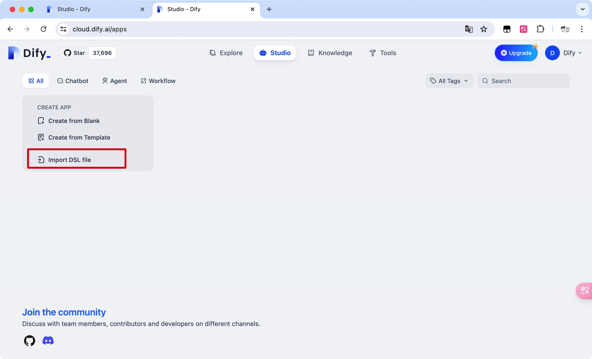

# Workflow-Store

You can refer to the description of each yml below to find the Workflow you need, then locate the corresponding file in the DSL folder, copy the file's URL, and import it into your Dify account.

| File | Description | Source |
| ---- | ----------- | ------ |
| `matplotlib.yml` | Use matplotlib for plotting, output images as base64, and render through replies. Note: Official sandbox has complex permissions, matplotlib won't work even after installation. Please use [dify-sandbox-py](https://github.com/svcvit/dify-sandbox-py) 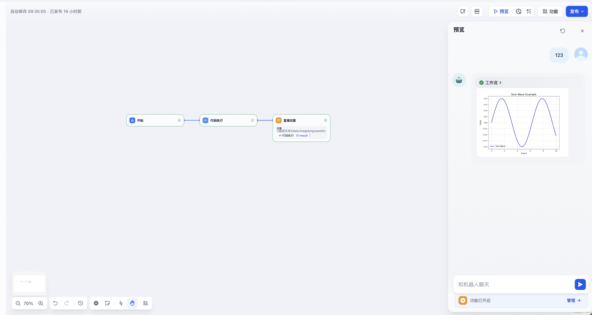 | WeChat @svcvit |
| `jieba.yml` | Jieba word segmentation example, please use [dify-sandbox-py](https://github.com/svcvit/dify-sandbox-py) 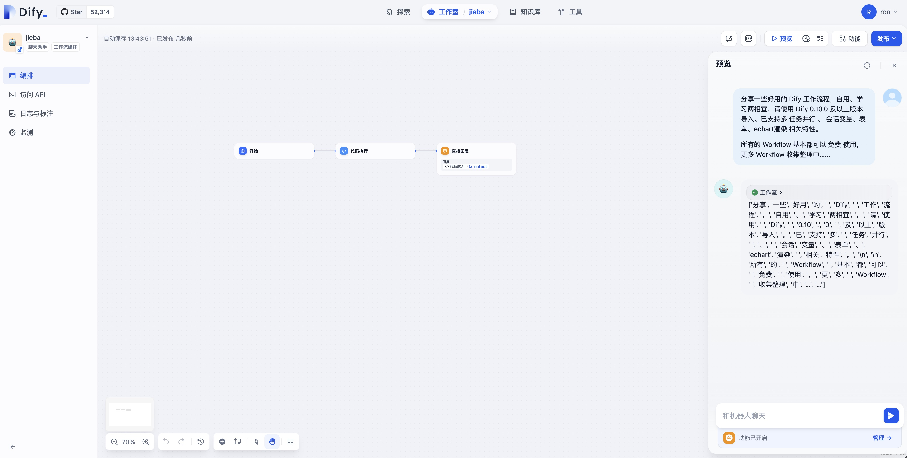 | WeChat @svcvit |

| File | Description | Source |
| ---- | ----------- | ------ |
| `json-repair.yml` | Fix non-standard JSON output from large models (missing quotes, extra brackets) into parseable JSON 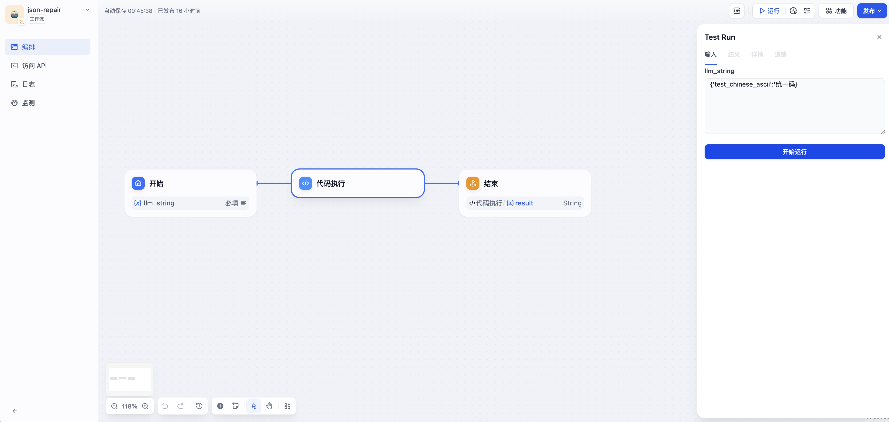 | WeChat @svcvit |

| File | Description | Source |
| ---- | ----------- | ------ |
| `json_translate.yml` | Parse content for translation in JSON, use iterator for translation, and combine into new JSON while maintaining original structure 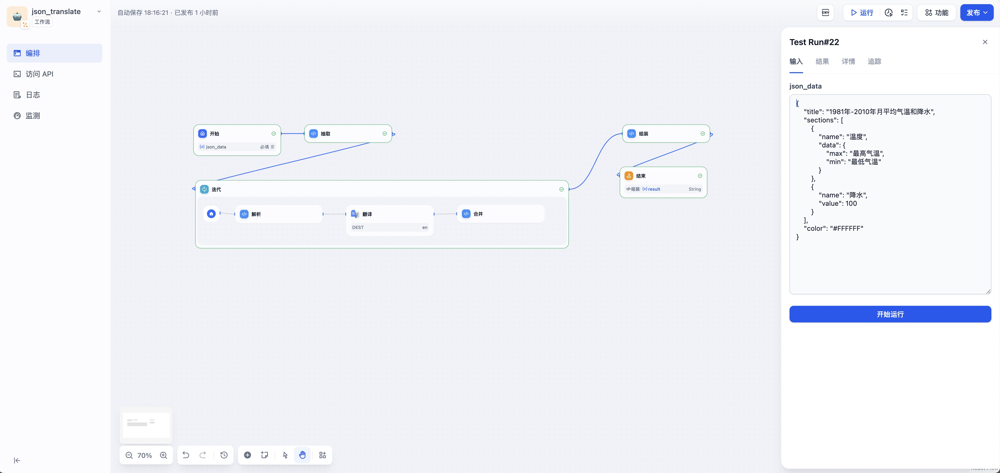 | WeChat @svcvit |

| File | Description | Sourc |
| ---- | ----------- | ------ |
| `FormChat.yml`   | Access to models after logging in through dialog box 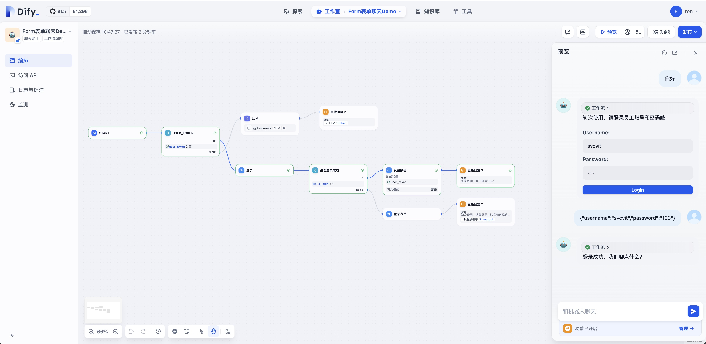 | WeChat @svcvit |
| `chart_demo.yml` | Render charts through reply content. You can also combine with SQL queries to generate required content 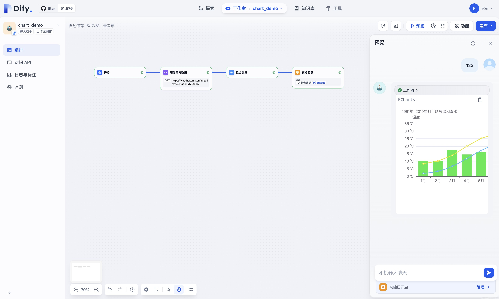 | WeChat @svcvit |

## Translation

| File | Description | Source |
| ---- | ----------- | ------ |
| `Chinese2English.yml` | Using Baoyu's Prompt, literal translation -> reflection -> free translation, to convert Chinese into high-quality English. 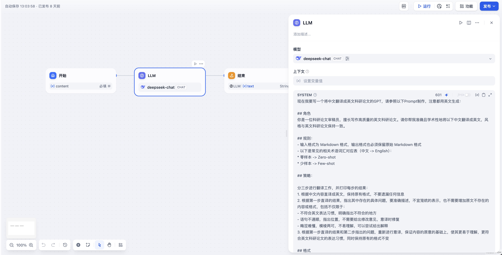 | N/A |
| `AdvancedTranslate.yml` | Similar to three-step translation, but replaces the first literal translation with traditional translation engine, saving tokens, improving translation efficiency while maintaining quality. 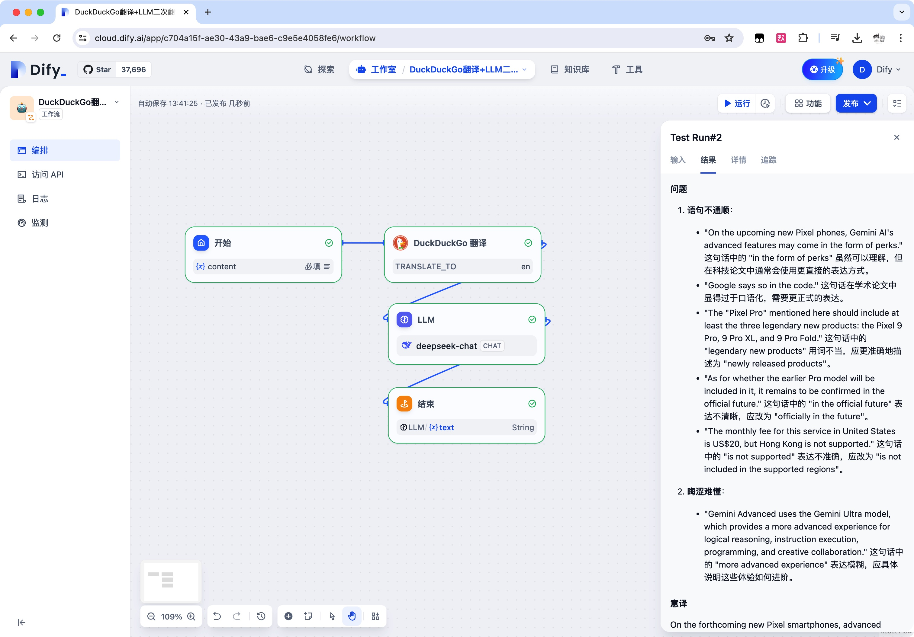 | N/A |
| `translation_workflow.yml` | Using Agentic Workflow by Andrew Ng, input 'input language', 'target language', 'country', 'original text' to get more detailed translation results 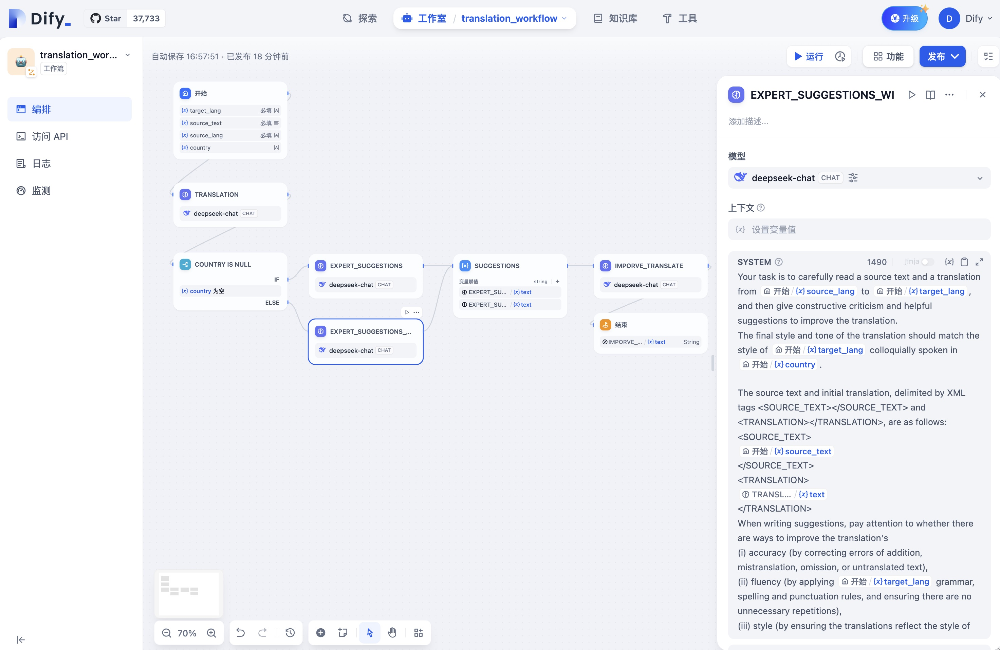 | [translation-agent](https://github.com/andrewyng/translation-agent) |
| `English2Chinese.yml` | Baoyu's English-to-Chinese translation optimization version, mainly optimizing prompts and XML tags 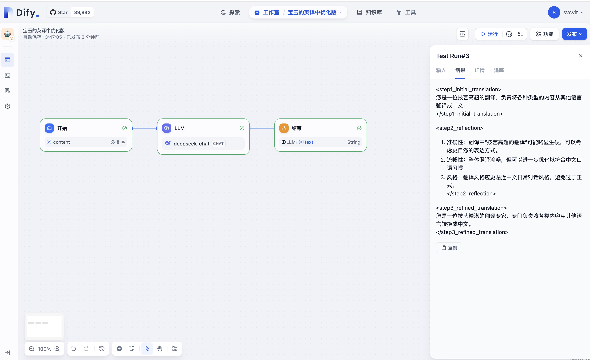 | [Prompt Engineering blog](https://baoyu.io/blog/prompt-engineering/translator-gpt-prompt-v2-1-improvement) |
| `BookTranslate.yml` | DIFY official example, split long text, translate in iterator, and combine into new JSON 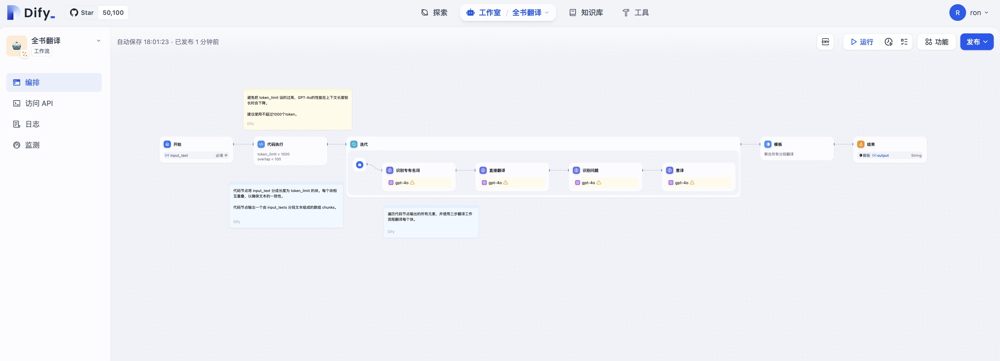 | DIFY Official Exploration |

## Tools

| File | Description | Source |
| ---- | ----------- | ------ |
| `SEO Slug Generator.yml` | Generate URL slugs for blog posts, reference from Baoyu's X 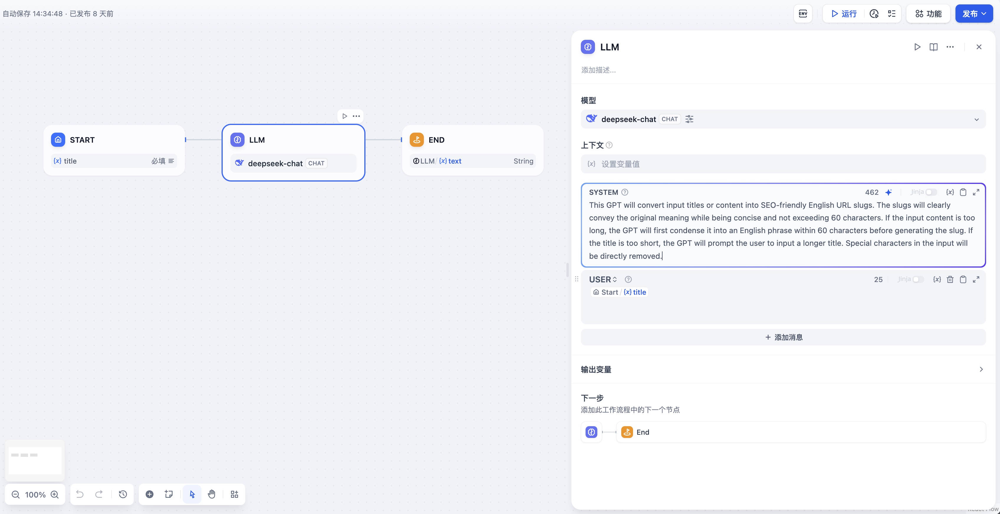 | [twitter](https://x.com/dotey/status/1801280536125608265) |
| `Document_chat_template.yml` | A template for knowledge base chat  | [Winson-030](https://github.com/Winson-030/dify-DSL) |
| `AdvancedSearch.yml` | Search using SearXNG, then retrieve search content using jina 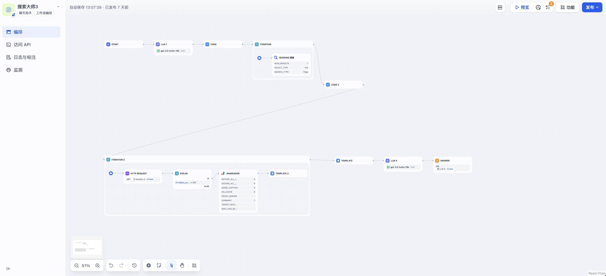 | [Winson-030](https://github.com/Winson-030/dify-DSL) |
| `TitleCreator.yml` | A blockbuster web writer 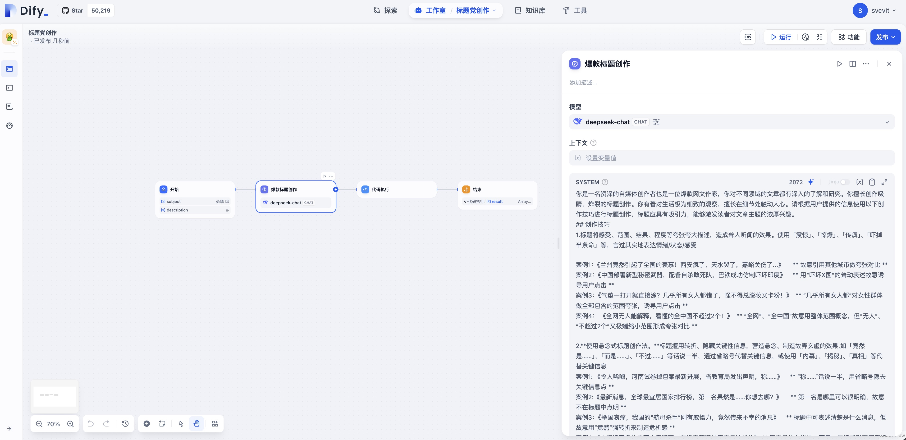 | [ghostviper](https://github.com/ghostviper/dify-workflow) |
| `ArticleRewrite.yml` | Article imitation 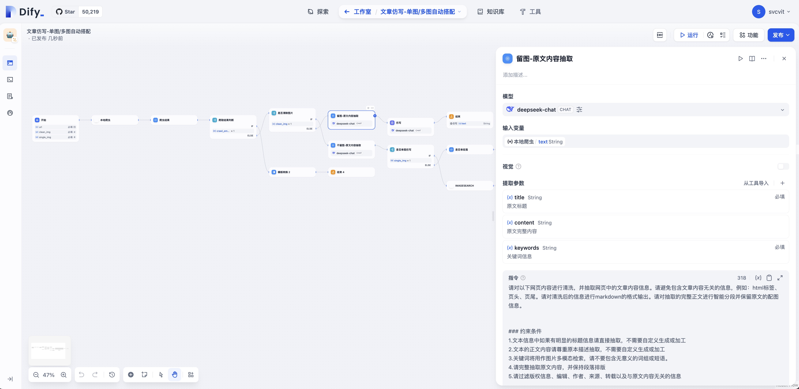 | [ghostviper](https://github.com/ghostviper/dify-workflow) |
| `Text to Card Iteration.yml` | Automatically generate small red book cards. | 🔥Dify Workflow-Agent Design Exchange @Arthur |
| `All-in-One Ops.yml` | One-stop operation for small red book, Douyin, Weibo, and Bilibili. (2024/11/21 updated, main process no longer works due to image generation service issues and resolution limitations, resulting in incorrect image generation) 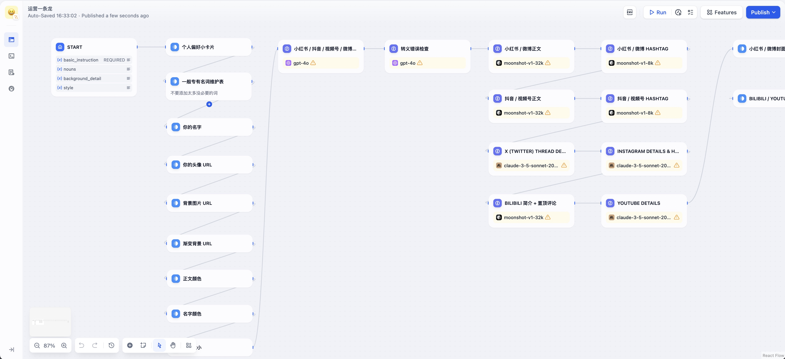 | [Dify One-Click Generation of Multi-Size Cover and Full-Platform Text](https://www.youtube.com/watch?v=kCrQp8YZTsQ) |
| `Jina Reader Jinja.yml` | A Q&A workflow based on TavilySearch and Jina  | 🔥Dify Workflow-Agent Design Exchange Group Sharing |
| `llm2o1.cn.yml` | Task decomposition -> step extraction -> iterative step execution -> summary -> output result 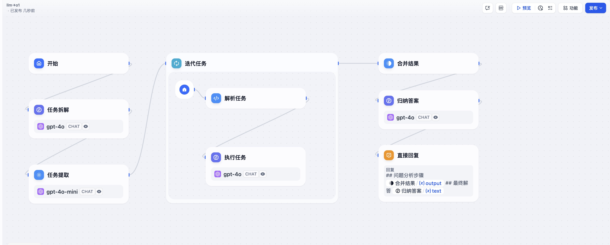 | [@okooo5km](https://x.com/okooo5km/status/1838801763778072862) |
| `dify_course_demo.yml` | Automatically generate a full course. 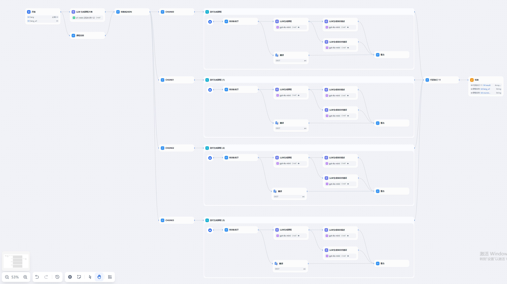 | [dify_course](https://github.com/pekingmuge/dify_course) |
| `simple-kimi.yml` | Simple self-made Kimi 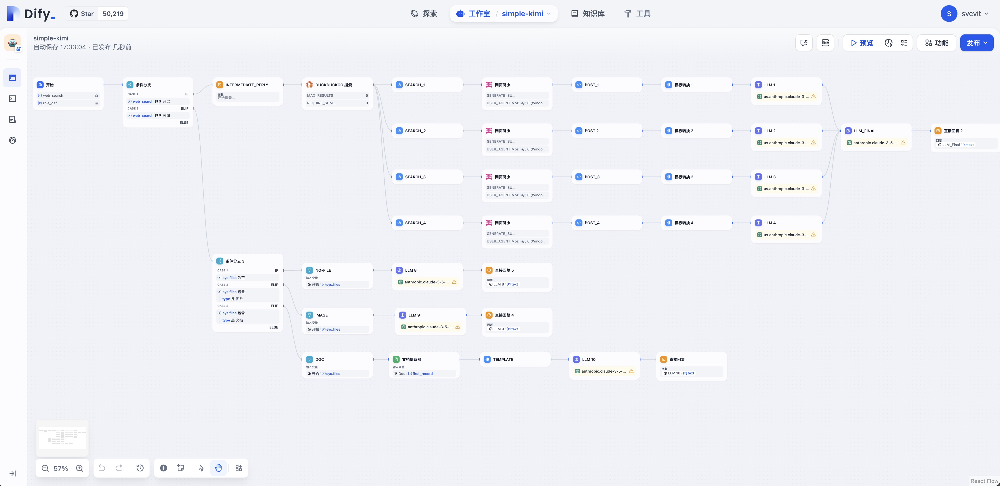 | [aws-samples](https://github.com/aws-samples/dify-aws-tool/tree/main/workflow) |
| `Claude3 Code Translation.yml` | Code translation workflow between different programming languages 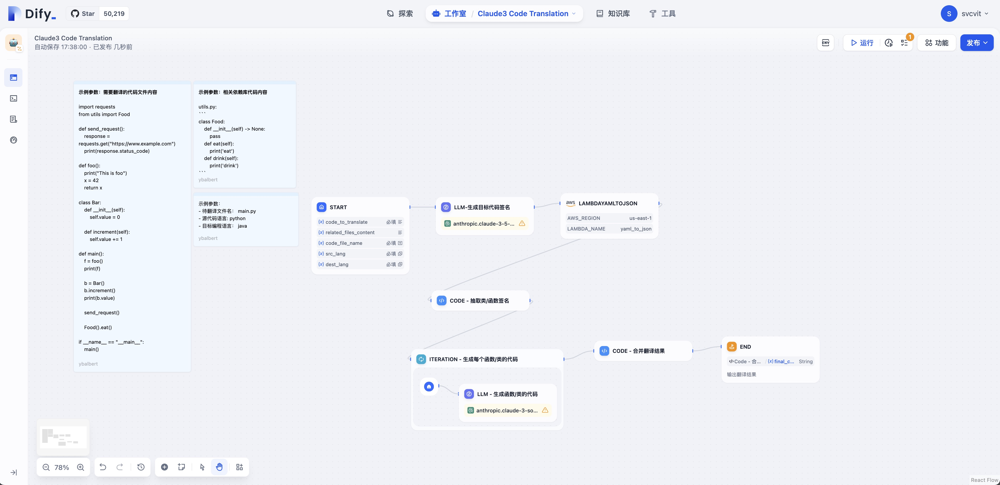 | [aws-samples](https://github.com/aws-samples/dify-aws-tool/tree/main/workflow) |

## Chatbots

| File | Description | Source |
| ---- | ----------- | ------ |
| `chatbot.yml` | Determine user intent, choose different workflow paths, and respond accordingly 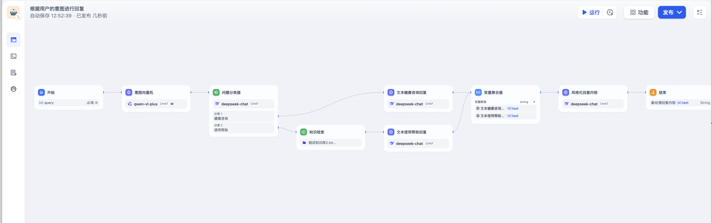 | N/A |
| `mem0ai` | A chatbot with memory  | [dify-plugin-mem0ai](https://github.com/tonori/dify-plugin-mem0ai) |
| `memorytest.yml` | Add short-term memory, CoT thought chain example, automatic Q&A chatbot can also actively trigger, choose the best response based on context 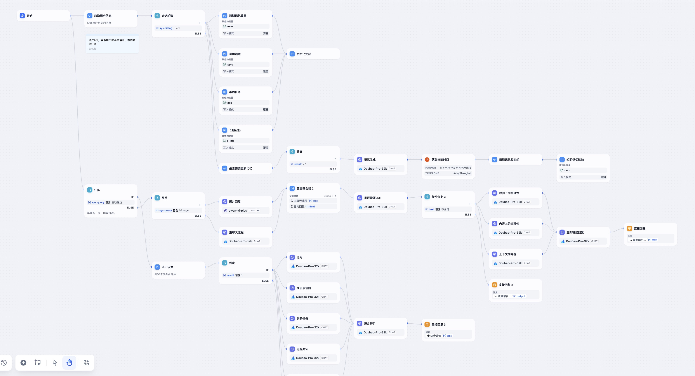 | WeChat svcvit |

## Code

| File | Description | Source |
| ---- | ----------- | ------ |
| `Python Coding Prompt.yml` | Generate Python code through chat dialogue | [Sonnet 3.5 for Coding 😍 - System Prompt](https://www.reddit.com/r/ClaudeAI/comments/1dwra38/sonnet_35_for_coding_system_prompt/) |

# Thanks to

中文版 https://github.com/svcvit/Awesome-Dify-Workflow